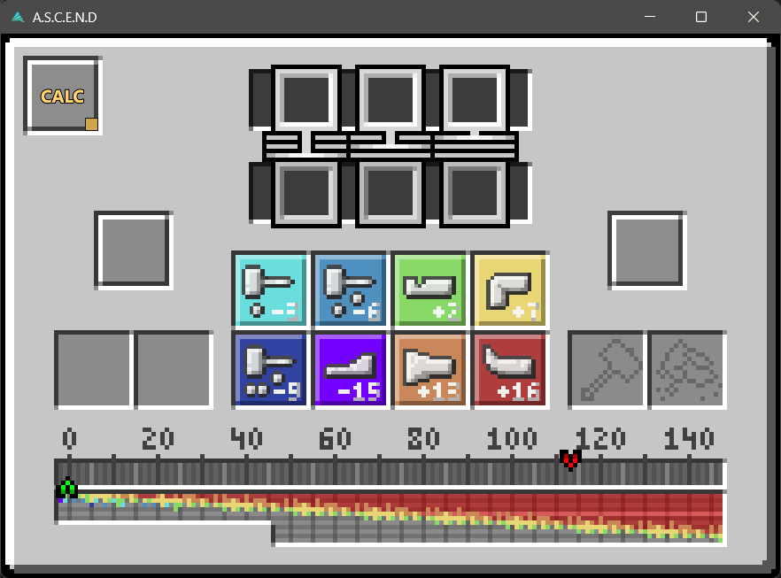

# Ascent

**A.S.C.E.N.D** is a portable Windows GUI tool for calculating and testing TerraFirmaCraft-style anvil working sequences.

The program helps you work with anvil target positions, required final moves, manual move input, and saved item templates.



## Features

- Calculator mode for finding a valid forging sequence.
- Manual mode for testing moves step by step.
- Movable start and target markers.
- Final move slots with visual matching.
- Manual history slots showing the last three moves.
- Template system:
  - load saved templates;
  - save new templates;
  - delete templates;
  - search templates;
  - assign item icons.
- Portable Windows build. No installer required.

## Download

The easiest way to use Ascent is to download the portable release.

1. Open the GitHub repository page.
2. On the right side of the page, find **Releases**.
3. Open the latest release.
4. Download the portable archive:

   ```text
   A.S.C.E.N.D_v0.2.0_portable.zip
   ```

5. Extract the ZIP archive.
6. Open the extracted folder.
7. Run:

   ```text
   A.S.C.E.N.D.exe
   ```

Do **not** run the program directly from inside the ZIP archive. Extract the whole folder first, because the executable needs the included Qt DLLs and plugin folders.

## Windows SmartScreen warning

This build is currently unsigned.

Windows SmartScreen may show a warning such as:

```text
Windows protected your PC
Unknown publisher
```

If you downloaded the program from the official GitHub release and trust the file, click:

```text
More info → Run anyway
```

This warning appears because the executable does not have a paid code-signing certificate.

## Basic usage

### Calculator mode

Calculator mode is used when you want the program to find a valid sequence automatically.

1. Select the required final moves in the three upper slots.
2. Move the red marker to the target position.
3. Optionally move the green marker if you want a custom start position.
4. Press the sequence button.
5. The program will show the calculated move sequence.

### Manual mode

Manual mode is used when you want to test moves yourself.

1. Switch to manual mode.
2. Press the move buttons manually.
3. The green marker moves according to your input.
4. The lower slots show the last three moves.
5. If a move matches the selected final moves, the matching slot is highlighted.

## Templates

Templates save commonly used forging setups.

A template stores:

- item name;
- material;
- item icon;
- target value;
- required final moves.

### Load a template

1. Press the template button.
2. Search for a saved template if needed.
3. Click the template.
4. The program automatically applies:
   - the item icon;
   - the target position;
   - the required final moves.

When a template is selected, the green start marker is reset to `0` and the program switches back to calculator mode. You can still move the green marker manually afterward if you need a custom start position.

### Save a template

1. Set the target position with the red marker.
2. Select the required final moves in the upper slots.
3. Open the template panel.
4. Press **SAVE**.
5. Select an item icon.
6. Edit the template name if needed.
7. Save the template.

The new template will appear in the template list.

### Delete a template

1. Open the template panel.
2. Find the template in the list.
3. Press **DEL** next to the template.

## Template storage

Saved templates are stored in:

```text
%APPDATA%\A.S.C.E.N.D\templates.json
```

On Windows this usually means:

```text
C:\Users\<YourUserName>\AppData\Roaming\A.S.C.E.N.D\templates.json
```

This file contains user-created templates. It is separate from the program files.

## Screenshots

Recommended screenshots for this repository:

```text
docs/images/main-window.png
docs/images/template-panel.png
docs/images/save-template.png
docs/images/sequence-result.png
```

Minimum required screenshot:

```text
docs/images/main-window.png
```

Suggested screenshot content:

| File | What to show |
|---|---|
| `docs/images/main-window.png` | Main program window with the anvil interface |
| `docs/images/template-panel.png` | Template list with search, SAVE, and DEL buttons |
| `docs/images/save-template.png` | Save template panel with item icon selection |
| `docs/images/sequence-result.png` | Calculated sequence dropdown |

If you only want one image for now, add only `main-window.png` and leave the other screenshots for later.

## Build from source

### Requirements

- Qt 6
- Qt Creator
- CMake
- MinGW 64-bit toolchain

### Build steps

1. Clone the repository.
2. Open the project in Qt Creator using:

   ```text
   CMakeLists.txt
   ```

3. Select a Qt MinGW kit, for example:

   ```text
   Desktop Qt 6.x.x MinGW 64-bit
   ```

4. Choose a build configuration:
   - `Debug` for development;
   - `Release` for portable builds.

5. Build the project.

### Create a portable Windows build

After building the Release configuration, copy the executable into a deploy folder and run `windeployqt`.

Example:

```cmd
windeployqt --release --qmldir D:\QTp\ASCEND_GUI "D:\QTp\ASCEND_DEPLOY\A.S.C.E.N.D_v0.2.0\A.S.C.E.N.D.exe"
```

Then zip the whole deploy folder.

The ZIP must include the executable and all deployed Qt files, for example:

```text
A.S.C.E.N.D.exe
Qt6Core.dll
Qt6Gui.dll
Qt6Qml.dll
Qt6Quick.dll
platforms/
qml/
imageformats/
```

## Repository structure

```text
ASCEND_GUI/
├── assets/
│   ├── moves/
│   ├── templates/
│   │   └── items/
│   └── ui/
├── core/
├── Main.qml
├── main.cpp
├── SolverBridge.h
├── SolverBridge.cpp
├── TemplateBridge.h
├── TemplateBridge.cpp
├── TemplateData.h
├── TemplateStorage.h
├── TemplateStorage.cpp
└── CMakeLists.txt
```

## Notes on TerraFirmaCraft assets

This project may include item or icon assets derived from or based on TerraFirmaCraft resources.

TerraFirmaCraft is developed by its respective authors. This project is not affiliated with, endorsed by, or maintained by the TerraFirmaCraft team.

Third-party assets remain under their original licenses and ownership.

## License

This project is licensed under the European Union Public Licence v1.2.

See the [`LICENSE`](LICENSE) file for details.
